# VT 框架技术分析与开发规划

## 文档概述

本文档旨在对现有的基于 Intel VT-x 的 Hypervisor 框架进行全面的技术剖析，并为后续的功能扩展（包括 Ring 3 EPT Hook 和高级隐蔽 Hook）提供详细的设计与实现规划。

---

## 第一部分：VT 框架核心技术分析

### 1.1 虚拟化生命周期

#### 1.1.1 环境检测与初始化

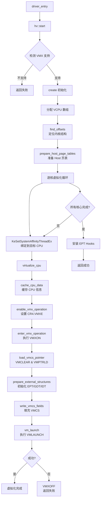

- **检测**: 流程始于 `virtualize_cpu` -> `cache_cpu_data`。
  1. 通过 `__cpuid` 指令检查 CPU 是否支持 VMX（`CPUID.01H:ECX.5[VME] = 1`）。
  2. 读取 `IA32_FEATURE_CONTROL` MSR，确保 VMX 在 BIOS/UEFI 中未被锁定禁用。
- **初始化**:
  1. **启用 VMX**: `enable_vmx_operation` 函数设置 `CR4.VMXE` 位，并根据 `IA32_VMX_CR0/CR4_FIXED0/1` MSRs 的要求修正 CR0 和 CR4 的保留位，以满足 VMX 的硬件要求。
  2. **进入 VMX**: `enter_vmx_operation` 函数分配 `VMXON` 区域，并执行 `VMXON` 指令，使处理器进入 VMX root-operation 模式。
  3. **VCPU 虚拟化**: `hv::start()` 函数遍历所有 CPU 核心，通过 `KeSetSystemAffinityThreadEx` 将初始化线程绑定到每个核心上，并逐一调用 `virtualize_cpu()` 对其进行虚拟化。
  4. **执行 VMLAUNCH**: `virtualize_cpu()` 的最后一步是调用 `vm_launch`（位于 `vm-launch.asm`），执行 `VMLAUNCH` 指令。一旦成功，CPU 即在 Guest 模式下运行，Hypervisor 初始化完成。

#### 1.1.2 卸载流程

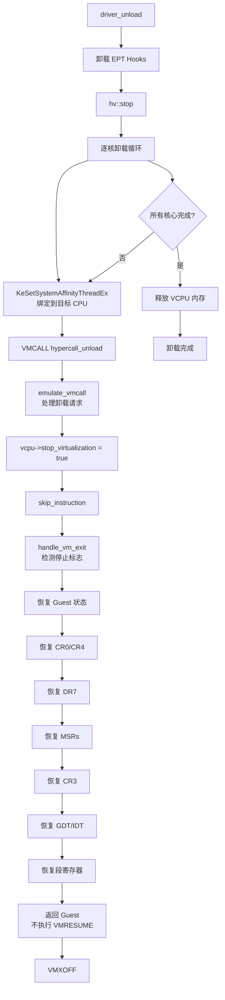

- **发起卸载**: Guest 内核驱动调用 `hv::stop()`。
- **逐核卸载**: 类似于启动过程，通过 `KeSetSystemAffinityThreadEx` 在每个核心上发起 `hypercall_unload` VMCALL。
- **处理卸载**: `emulate_vmcall` 捕捉到该请求，将 `vcpu->stop_virtualization` 标志位置 `true`。
- **恢复现场**: 在下一次 `vm_exit` 的返回路径上 (`handle_vm_exit`)，检测到 `stop_virtualization` 标志，执行完整的现场恢复逻辑（恢复GDT, IDT, CR3, DR7, MSRs 等），并直接返回到 Guest，不再执行 `VMRESUME`。最后执行 `VMXOFF` 退出 VMX 模式。

### 1.2 核心组件深入解析

#### 1.2.1 系统整体架构图

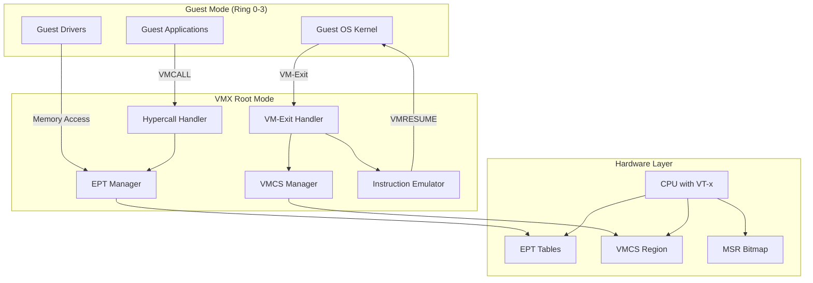

#### 1.2.2 VMCS (Virtual Machine Control Structure)

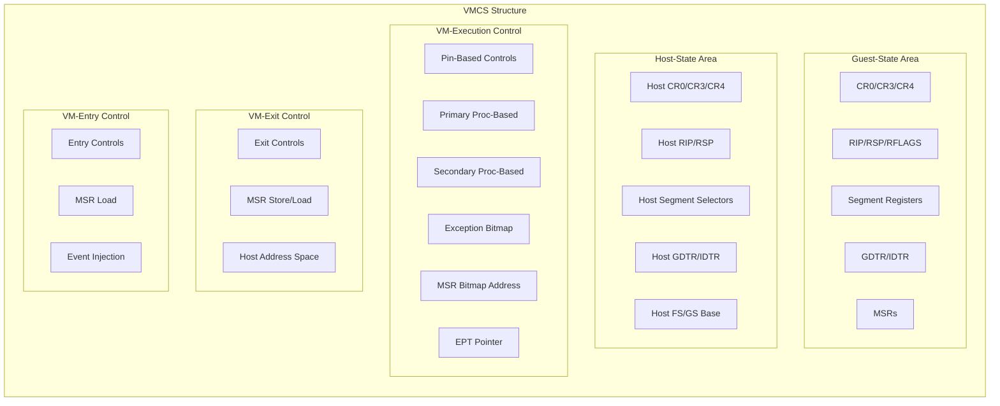

VMCS 是 VMX 操作的核心，它精确定义了 Guest 的运行环境以及 Host 的行为。
- **Host-State Area (`write_vmcs_host_fields`)**:
  - `VMCS_HOST_RIP/RSP`: 设置为汇编例程 `vm_exit` 的地址和 Host 栈顶，是所有 VM-Exit 的统一入口。
  - `VMCS_HOST_CR3`: 指向 Hypervisor 自己的页表，确保 VM-Exit 后能切换到正确的地址空间。
  - `VMCS_HOST_FS_BASE`: 指向当前 `vcpu` 结构体地址，这是一个巧妙的设计，使得 Host 代码可以方便地通过 `fs:[0]` 访问当前核心的数据。
- **Guest-State Area (`write_vmcs_guest_fields`)**:
  - 这是一个完整的"现场快照"过程。在 `VMLAUNCH` 之前，将当前 CPU 的所有状态（CR0/3/4, GDT, IDT, CS, SS, RIP, RSP, RFLAGS, MSRs 等）完整地保存到 VMCS 的 Guest 区域。这保证了 Guest 能够从中断的那个点无缝地继续执行。
- **VM-Execution Controls (`write_vmcs_ctrl_fields`)**:
  - 这是 Hypervisor 的"控制面板"，决定了哪些 Guest 事件必须陷入（VM-Exit）到 Hypervisor。
  - **关键设置**:
    - `enable_ept = 1`: **开启 EPT**。这是实现高性能内存虚拟化、也是 EPT Hook 的基础。
    - `use_msr_bitmaps = 1`: 启用 MSR 位图，高效地指定对哪些 MSR 的读写需要拦截。
    - `cr3_load_exiting = 1`: 拦截 `MOV to CR3` 指令，用于追踪 Guest 地址空间切换。
    - `activate_secondary_controls = 1`: 启用 EPT、VPID 等高级功能所必需。

#### 1.2.3 EPT (Extended Page Tables)

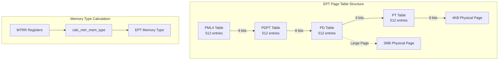

- **构建**: `prepare_ept` 函数构建了覆盖所有物理内存的 1:1 恒等映射（GPA==HPA），并默认使用 2MB 大页进行优化以减少 TLB miss。
- **MTRR 同步**: `enable_mtrr_exiting` 通过设置 MSR Bitmap 拦截所有对 MTRR 相关 MSR 的写操作。当 Guest 修改 MTRR 时，`emulate_wrmsr` 捕获该事件，在允许修改后，立即调用 `update_ept_memory_type` 重新计算 EPT 页表项的内存类型（如 WB、UC），并调用 `vmx_invept` 使缓存失效，从而保持 EPT 与 MTRR 的同步。
- **按需分裂 (`split_ept_pde`)**: EPT Hook 的操作精度是 4KB。当需要在某个 2MB 区域内的一个 4KB 页面上安装 Hook 时，此函数会将一个 2MB 的大页（PDE）"分裂"成 512 个 4KB 的小页（PTE），从而在不牺牲整体性能的前提下，实现精确的 Hook。

#### 1.2.4 VM-Exit 处理流程

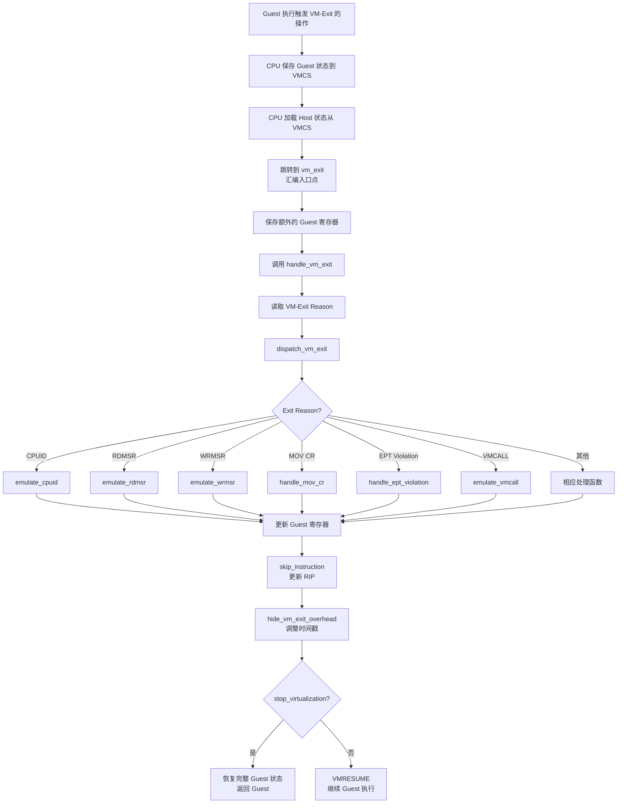

- **统一入口**: 所有 VM-Exit 都从 `vm-exit.asm` 中的 `vm_exit` 开始，保存 Guest 寄存器到栈上。
- **分发**: 汇编代码调用 C++ 函数 `handle_vm_exit`。该函数读取 `VMCS_EXIT_REASON`，并调用 `dispatch_vm_exit` 将控制权分发给具体的模拟函数（如 `emulate_cpuid`, `handle_mov_cr` 等）。
- **VMCALL**: `emulate_vmcall` 是 `VMCALL` 指令的专属处理器。它通过一个 `hypercall_key` 进行校验，然后根据 `RAX` 中的功能号，将请求分发到 `hypercalls.cpp` 中的具体实现，如 `hc::install_ept_hook`。

---

## 第二部分：新功能开发规划

### 2.1 功能规划：Ring 3 EPT Hook 框架

#### 2.1.1 目标
允许一个 Ring 3 应用程序通过一个内核驱动程序作为代理，安全地调用 Hypervisor 提供的 `install_ept_hook` 功能，从而在用户模式下实现对任意代码的 EPT Hook。

#### 2.1.2 架构设计

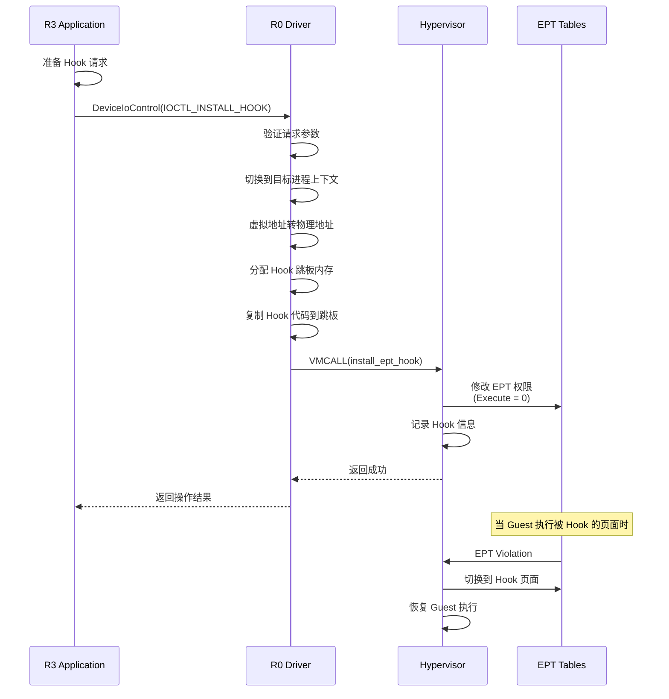

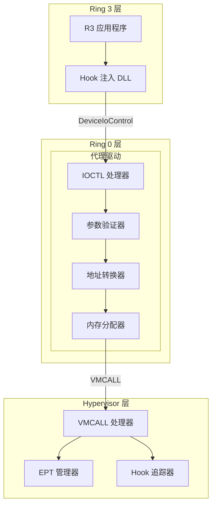

#### 2.1.3 实现步骤 (R0 内核驱动)
1.  **定义 IOCTL**: 在驱动头文件中定义一个唯一的 IOCTL 码和通信用的结构体。
    ```cpp
    #define IOCTL_INSTALL_HOOK CTL_CODE(FILE_DEVICE_UNKNOWN, 0x800, METHOD_BUFFERED, FILE_ANY_ACCESS)

    typedef struct _HOOK_REQUEST {
        HANDLE TargetProcessId;
        PVOID  TargetAddress;
        PVOID  HookFunction;
        SIZE_T HookSize;
    } HOOK_REQUEST, *PHOOK_REQUEST;
    ```
2.  **驱动入口 (`DriverEntry`)**:
    - `IoCreateDevice`: 创建一个设备对象。
    - `IoCreateSymbolicLink`: 创建一个用户模式可见的符号链接 (例如, `\\??\\MyHypervisorDevice`)。
    - 注册 `IRP_MJ_CREATE`, `IRP_MJ_CLOSE`, `IRP_MJ_DEVICE_CONTROL` 的调度例程。
3.  **IOCTL 处理例程 (`IrpDeviceControlHandler`)**:
    - 校验 IOCTL 码是否匹配。
    - 从 `Irp->AssociatedIrp.SystemBuffer` 中获取 `HOOK_REQUEST` 结构体。
    - **安全检查**: 验证 `TargetAddress` 和 `HookFunction` 是否是有效的用户模式地址。
    - **地址转换**:
        a. 使用 `PsLookupProcessByProcessId` 获取目标进程的 `EPROCESS` 结构。
        b. 使用 `KeStackAttachProcess` 切换到目标进程的地址空间。
        c. 调用 `MmGetPhysicalAddress` 将 `TargetAddress`（虚拟地址）转换为物理地址。
        d. `KeUnstackDetachProcess` 恢复原地址空间。
    - **分配 Hook 跳板**:
        a. 使用 `ExAllocatePoolWithTag(NonPagedPoolNx, ...)` 在内核中分配一块可执行内存作为跳板（Trampoline）。
        b. 跳板中应包含要执行的 Hook 代码，以及一个跳转回原始函数后续部分的指令。
        c. 使用 `ProbeForRead` 安全地从用户模式的 `HookFunction` 地址读取 Hook 代码，并复制到跳板中。
    - **发起 Hypercall**:
        a. 将目标页面的物理页帧号（PFN）放入 `RCX`。
        b. 将跳板页面的 PFN 放入 `RDX`。
        c. 设置 `RAX` 为 `hypercall_install_ept_hook` 的功能码。
        d. 执行 `VMCALL`。
    - **返回结果**: 将 `RAX` 中 Hypervisor 的返回值通过 `Irp->IoStatus.Information` 返回给 R3 应用。

#### 2.1.4 实现步骤 (R3 客户端)
```cpp
// R3 C++ Client Example
#include <windows.h>
// ... (include IOCTL definition)

int main() {
    HANDLE hDevice = CreateFile(L"\\\\.\\MyHypervisorDevice", ...);
    if (hDevice == INVALID_HANDLE_VALUE) return 1;

    HOOK_REQUEST req = { 0 };
    req.TargetProcessId = GetCurrentProcessId();
    req.TargetAddress = (PVOID)GetProcAddress(GetModuleHandle(L"ntdll.dll"), "NtOpenFile");
    req.HookFunction = &MyHookFunction; // User-defined hook
    req.HookSize = ...;

    DWORD bytesReturned = 0;
    BOOL result = DeviceIoControl(hDevice, IOCTL_INSTALL_HOOK, &req, sizeof(req), nullptr, 0, &bytesReturned, nullptr);

    // ...
    CloseHandle(hDevice);
    return 0;
}
```

### 2.2 功能规划："CC 隐藏" (单步重定向 Hook)

#### 2.2.1 目标
实现一种高级 EPT Hook。当安装后，对目标页面的所有**读/写**操作都被透明地重定向到一个无害的伪造页，而所有**执行**操作则在原始页面上以**单步模式**执行并被监控。这常用于隐藏断点（如 `0xCC`）或实现无痕 F.I.R.E. (Framework for In-memory Record and Execution)。

#### 2.2.2 核心概念：MTF (Monitor Trap Flag) 循环

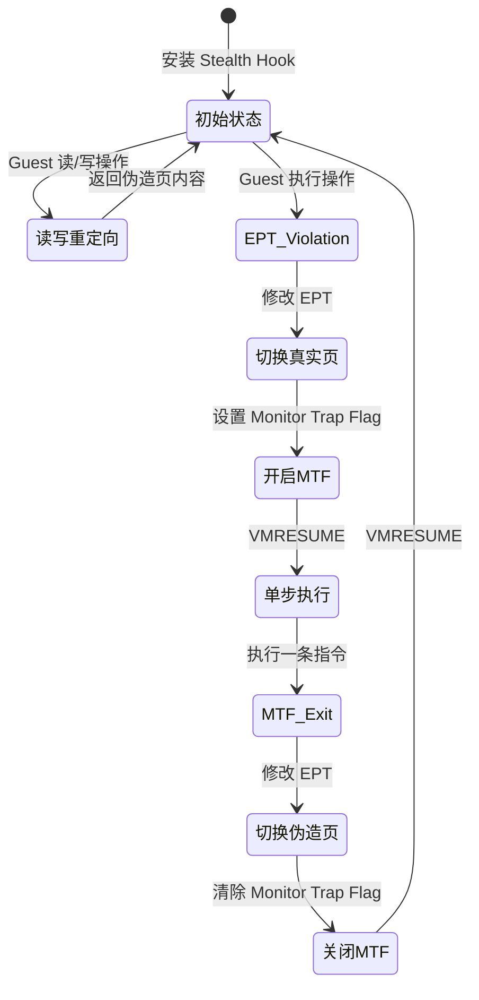

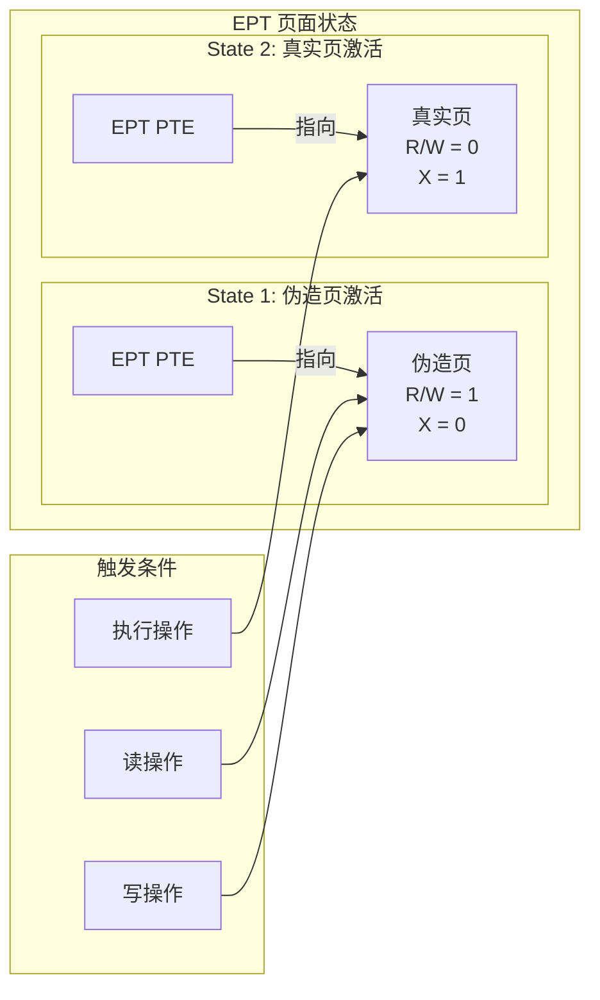

1.  **初始状态**: EPT 指向伪造页（可读写，不可执行）。
2.  **执行触发**: Guest 尝试执行代码 -> EPT Violation -> VM-Exit。
3.  **Host 响应**:
    a. EPT 切换回**真实页**（仅可执行）。
    b. 开启 VMCS 中的 **Monitor Trap Flag (MTF)**。
    c. VM-Resume。
4.  **单步执行**: Guest 在真实页上执行**一条**指令。
5.  **MTF 触发**: 指令执行完毕 -> MTF VM-Exit。
6.  **Host 恢复**:
    a. EPT 切换回**伪造页**（可读写，不可执行）。
    b. 关闭 MTF。
    c. VM-Resume。Guest 返回初始状态，等待下一次执行。

#### 2.2.3 实现步骤 (Hypervisor)

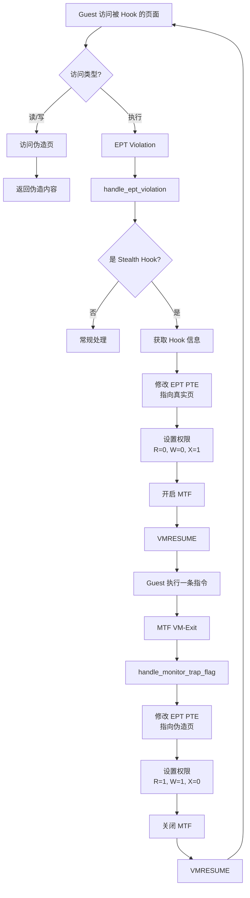

1.  **新增 Hypercall**:
    - 在 `hypercalls.h` 中定义 `hypercall_install_stealth_hook`。它只需要一个参数：`target_physical_address`。
2.  **数据结构**: 创建一个新的 Hook 追踪结构。
    ```cpp
    typedef struct _STEALTH_HOOK_INFO {
        LIST_ENTRY          Link;
        UINT64              OriginalPfn;
        UINT64              DummyPfn; // PFN of the fake page
    } STEALTH_HOOK_INFO, *PSTEALTH_HOOK_INFO;
    ```
3.  **实现 `hc::install_stealth_hook` (`hypercalls.cpp`)**:
    - 从 `RCX` 获取 `target_physical_address`。
    - 分配一个新的 `STEALTH_HOOK_INFO` 节点和一个伪造页（Dummy Page）。
    - 调用新的底层函数 `ept::install_stealth_hook(target_pfn, dummy_pfn)`。
4.  **实现 `ept::install_stealth_hook` (`ept.cpp`)**:
    - 获取目标页面的 PTE（必要时分裂）。
    - **设置初始状态**:
      - 将 PTE 的 `page_frame_number` 设置为**伪造页**的 PFN。
      - 将 PTE 权限设置为 `Read=1, Write=1, Execute=0`。
    - `vmx_invept` 刷新缓存。
5.  **修改 `handle_ept_violation` (`exit-handlers.cpp`)**:
    - 添加新的逻辑分支：
    - `if (is_stealth_hook(physical_address) && qualification.execute_access)`:
      a. 找到对应的 `STEALTH_HOOK_INFO`。
      b. 获取 PTE，将其 `page_frame_number` 切换回**原始 PFN**。
      c. 设置权限为 `Read=0, Write=0, Execute=1`。
      d. 开启 MTF: `auto ctrl = read_ctrl_proc_based(); ctrl.monitor_trap_flag = 1; write_ctrl_proc_based(ctrl);`
      e. `vmx_invept` 刷新缓存。
      f. **不要** `skip_instruction()`，直接恢复执行。
6.  **修改 `handle_monitor_trap_flag` (`exit-handlers.cpp`)**:
    - 此函数现在是 MTF 循环的关键部分。
    - 从 `VMCS_GUEST_RIP` 推断出当前执行的页面，并找到对应的 `STEALTH_HOOK_INFO`。
    - **恢复初始状态**:
      a. 获取 PTE，将其 `page_frame_number` 切换回**伪造页 PFN**。
      b. 设置权限为 `Read=1, Write=1, Execute=0`。
      c. **关闭 MTF**: 在 `disable_monitor_trap_flag()` 函数中确保 `monitor_trap_flag` 被清零。
      d. `vmx_invept` 刷新缓存。
      e. `skip_instruction()` 并恢复执行。

### 2.3 EPT Hook 工作原理详解

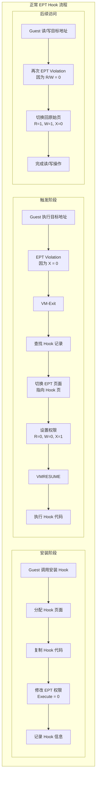

### 2.4 性能优化考虑

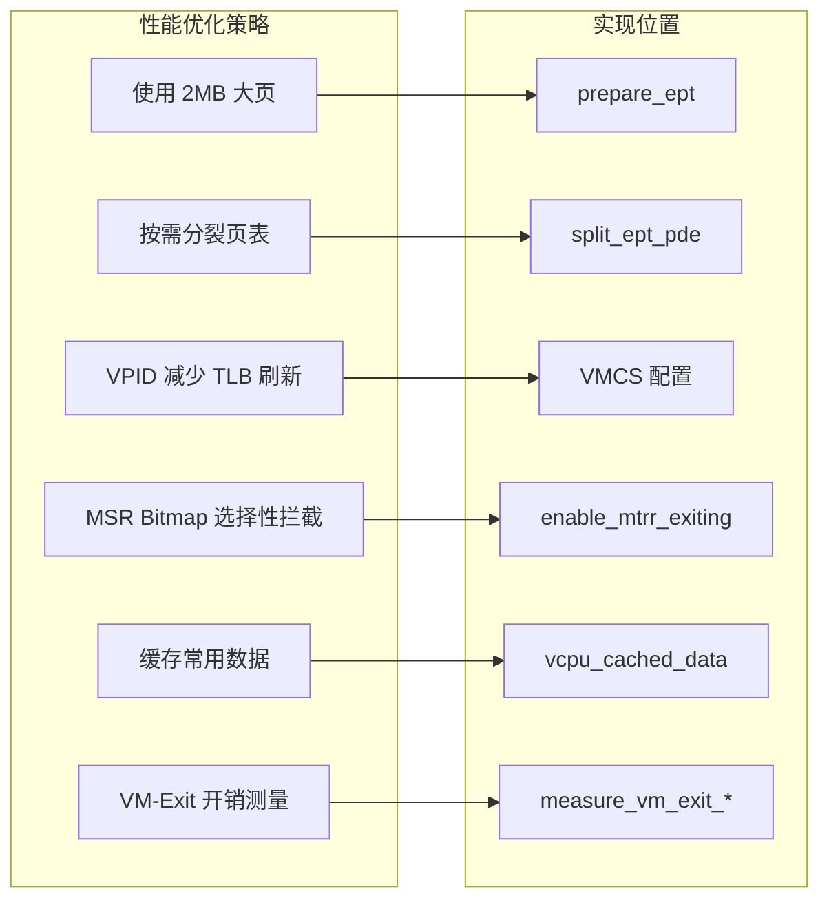

通过以上步骤，即可实现一个功能强大且隐蔽的执行监控 Hook。

---

## 第三部分：安全考虑与最佳实践

### 3.1 安全检查清单

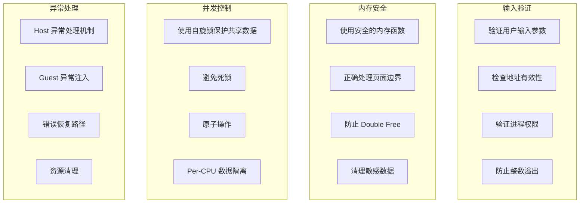

### 3.2 调试与测试建议

1. **单元测试**: 为每个 Hypercall 编写独立的测试用例。
2. **压力测试**: 大量并发的 Hook 安装/卸载操作。
3. **兼容性测试**: 在不同版本的 Windows 上进行测试。
4. **性能基准**: 测量 VM-Exit 开销，优化热点路径。
5. **安全审计**: 定期进行代码审查，使用静态分析工具。

---

## 结语

本文档提供了对现有 VT 框架的深入分析，以及实现高级 EPT Hook 功能的详细规划。通过遵循这些设计和实现指南，可以构建一个功能强大、性能优异且安全可靠的虚拟化安全解决方案。 